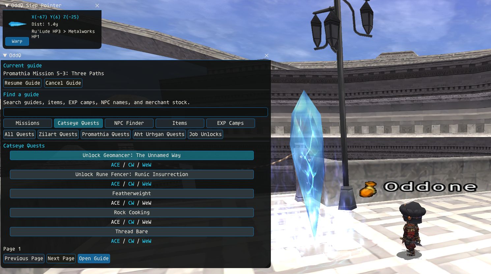
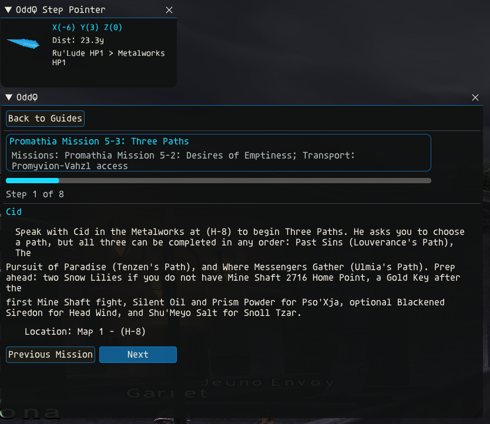
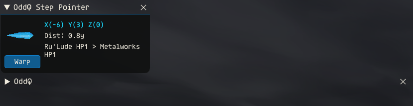

# OddQ

Clean, helpful quest and mission guidance for CatsEyeXI.

OddQ is a local Ashita v4 addon with a searchable Guide Browser, source-backed
item lookup, and a focused Guide view in one shared browser/guide window. A
compact, always-visible Step Pointer uses the player's local zone, position,
heading, and rank to guide the selected objective and show the optional Rank
10 milestone notice.

## Release status

`v1.0.7` is the current patch release. It adds source-backed item search, a
custom coordinate/grid pointer, and an **Items** Browser button. The Browser is
also taller by default so the Catseye Quests view shows five complete results.
Windurst 8-2 and 9-2 begin the pointer-authoritative guide model: the pointer
keeps detailed corridor legs and gates while the Guide presents fewer,
readable phases: 77 pointer legs behind 12 phases in 8-2 and 23 legs behind 11
phases in 9-2. The completed Windurst mission routing, faceted 3D HP-crystal
pointer, HP/SG-first route selection, mapless-zone exits, and progression
triggers from v1.0.6 remain included.

## In-game views

### Guide Browser

The primary row keeps **Items** between **NPC Finder** and **EXP Camps**, while
the taller Browser shows five complete Catseye Quest results.



### Guide display

The focused Guide view keeps the current mission step, destination, progress,
and navigation controls together while the Step Pointer remains visible.



### Minimal obstruction

The Guide window collapses while the compact Step Pointer keeps the selected
destination and available Warp action visible.



When source data establishes an objective's map number, OddQ displays it beside
the map-grid position. A grid with no recorded map number temporarily displays
as `Map #1`; this fallback is not written into source data. Ordinary mission,
quest, and job steps do not expose raw XYZ coordinates in the main Guide window.
The Step Pointer shows rounded XYZ for the current destination.
EXP guides intentionally show rounded X/Y guide markers in the main Guide window; these are
arrival or reset references, not verified pull locations.

## Install

Download the v1.0.7 release archive and copy:

```text
Ashita/addons/oddq -> <Ashita>/addons/oddq
```

Then load and open the addon:

```text
/addon load oddq
/odd
```

No executable, DLL, service, server change, or account credential is required.

## Using OddQ

Most players can use OddQ entirely through its windows and buttons:

1. Open OddQ and choose **Missions**, **Catseye Quests**, **NPC Finder**,
   **Items**, or **EXP Camps**.
2. Search, select a result, then choose **Open Guide** or **Open Item**.
3. Follow the Step Pointer. Use the Guide's **Previous** and **Next** controls
   only for semantic steps that cannot be observed safely.

The **Items** view searches 23,210 canonical numeric item identities by name,
ID, and alias. It currently has source details for 6,375 items across normal
drops, gil/guild shops, synthesis, and desynthesis. Exact merchant locations
can open a temporary pointer; ambiguous drop and recipe sources remain
descriptive. Item details also remind players to use `/find "<item>"` and check
Mog House/storage before farming. Known server drop-rate tokens are translated
to their documented percentages and rarity labels; unknown tokens stay clearly
identified instead of being guessed. Missing coverage is shown as **No sourced
acquisition path yet**.

When no guide is selected, **Custom Pointer** accepts copied `(X, Y)` pairs and
verified grids such as `(E-5)`. Multi-map zones require an explicit form such
as `Map 2 (E-5)` when the map page cannot be established safely. Custom
destinations are current-zone, no-warp, and intentionally session-only.

Loading a guide switches the shared window from Browser to Guide. **Back to
Guides** returns to search. The Browser's **Cancel Guide** button ends the
current guide and removes its saved reload state. Location rows show `Map N - (grid)` when both values
are sourced, or `Map #1 - (grid)` as the temporary missing-map fallback.
OddQ remembers the last loaded guide, selected step, Warp/No-Warp choice, and
window state across addon reloads and logins.

The Guide Browser also provides expansion quest collections for **Zilart
Quests**, **Promathia Quests**, and **Aht Urhgan Quests**. These follow the
in-game quest-log groupings represented by BG-Wiki: Outlands (59), Tavnazian
Safehold (21), and Aht Urhgan (73). Catalog-only entries are searchable but do
not claim pointer routing until their walkthrough locations are curated.

## Safety and privacy

OddQ is local and guidance-only. It reads the player's zone, position, rank,
heading, mounted status, and only the named item/key-item evidence required by
the current step. A receive-only handler observes cutscene identity; it never
blocks, changes, injects, or sends a packet. When the player clicks **Warp**
within interaction range of the selected HP or Survival Guide, OddQ sends only
`/uw hp <alias>` or `/uw sg <alias>` to the installed Uberwarp addon. Once per
addon session, it makes one read-only HTTPS request to the public OddQ GitHub
release API and prints a notice only when a newer stable version exists. It
never downloads or installs updates and does not read chat, move the player,
target entities, trade, cast, attack, follow, or handle credentials.

Its runtime writes are limited to the first-launch marker and validated guide
resume state under `config/addons/oddq`. Resume state contains only a bundled
guide ID, step number, route choice, view, window-open flag, and the two booleans
needed to restore the Rank 10 milestone notice. Player rank is not persisted.

See [docs/SECURITY.md](docs/SECURITY.md) and
[docs/REVIEW_GUIDE.md](docs/REVIEW_GUIDE.md) for the focused reviewer contract.
Source and data attribution are recorded in [NOTICE.md](NOTICE.md).

## Advanced text commands

The Browser and Guide buttons cover normal use. These durable commands are
available for keyboard-driven workflows and troubleshooting:

<details>
<summary>Show text commands</summary>

```text
/odd                              Open the guide browser
/odd <search>                     Load the best matching local guide
/odd missions|quests|jobs|exp     Browse a guide category
/odd npcs [search]                Browse or search NPC locations
/odd items [search]               Browse or search item acquisition details
/odd pointer <X,Y|GRID>|clear     Set or clear a custom current-zone pointer
/odd next                         Advance one guide step
/odd previous                     Return one guide step
/odd route warp|no-warp           Choose guidance for teleport unlocks
/odd warp-home                    Use the recommended available Warp Home item
/odd cancel                       Cancel the guide and clear its resume state
/odd status                       Print concise current guidance
/odd close                        Close OddQ
/odd help                         Print the durable command list
```

</details>

## License and redistribution

OddQ source code and original documentation are licensed under
[GPL-3.0-only](LICENSE). CatsEyeXI may package and redistribute OddQ under those
same terms. Redistributors must include the license, preserve applicable notices,
identify modifications, and provide corresponding OddQ source. This grant does
not license Square Enix material, third-party wiki content, or CatsEyeXI-owned
names and content; see [NOTICE.md](NOTICE.md) for the complete boundary.

## Release integrity

Release archives contain the 42-file reachable Lua runtime and its
bundled data. `MANIFEST.json` lists every packaged file, while
`SHA256SUMS.txt` provides independent checksums. Development tools, private
evidence, backups, captures, and executables are excluded.

## Current limitations

- OddQ selects guidance and teleport legs; it does not move the character.
- Unknown map pages use a visible `Map #1` presentation fallback until sourced
  page metadata is added.
- v1.0.7 has source, syntax, contract, layout, package, archive, and
  installed-hash evidence. Independent downloaded-asset validation follows
  publication. UI screenshots remain direct owner-supplied in-game captures.
- Item acquisition currently covers normal drops, gil/guild shops, synthesis,
  and desynthesis. Currency exchanges, quest rewards, battlefields, NM spawn
  rules, HELM, chests/coffers/caskets, and key items remain future source work.
