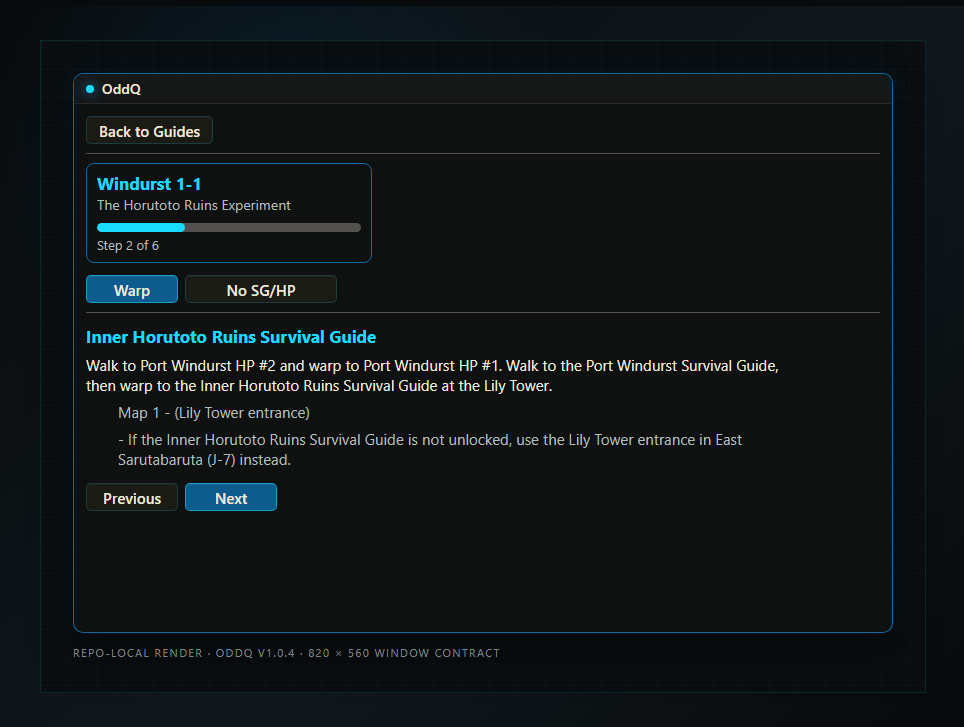
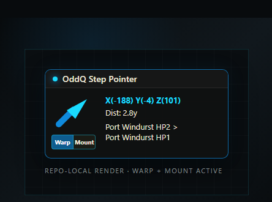

# OddQ

Clean, helpful quest and mission guidance for CatsEyeXI.

OddQ is a local Ashita v4 addon with two focused views in one shared window:

- **Browser** searches and filters the bundled guide catalog.
- **Guide** shows the selected guide and its current step.

The `OddQ` main window is movable and content-bounded. A compact, always-visible
Step Pointer reads the player's local zone, position, and heading and points at
the selected guide step. There is no Settings popup, developer tuner, map-pin
panel, bridge, backend, updater, or outgoing packet automation.

## Release status

`v1.0.4` is the current stable public patch release. It adds persistent guide
resume state, expansion quest collections, mode ownership labels, Warp Home,
passive authored progression checks, and the broad nation-mission routing and
pointer corrections from the latest playtest pass.

## Current interface





## Install

Copy the release addon folder into Ashita:

```text
Ashita/addons/oddq -> <Ashita>/addons/oddq
```

Load and open it in game:

```text
/addon load oddq
/odd
```

No executable, DLL, service, bridge, backend, or server change is required.

## Commands

```text
/odd                       Open the guide browser
/odd <search>              Load the best matching local guide
/odd missions              Browse mission guides
/odd quests                Browse quest guides
/odd jobs                  Browse job-unlock guides
/odd exp                   Browse EXP-camp guides
/odd next                  Advance to the next guide step
/odd previous              Return to the previous guide step
/odd status                Print concise current-step guidance
/odd close                 Close OddQ
/odd help                  Print the command list
```

Loading a guide replaces the Browser view in the same window. **Back to
Guides** returns to search without opening another window.
OddQ restores the last loaded guide, selected step, Warp/No-Warp choice, and
window state after an addon reload or the next login.
Quest, mission, and job search rows show `ACE / CW / WeW` ownership instead of
map metadata. Supported modes are blue, unavailable modes are white, and the
separators remain white.
The bundled standard quest catalog includes every BG-Wiki-listed Windurst (92),
San d'Oria (82), Bastok (94), and Jeuno (159) quest. Existing routed guides take
priority; a title that is indexed but not routed is labeled **Catalog entry
only** instead of presenting invented directions.

## Location behavior

- A source-backed map number and grid render as `Map N - (grid)`.
- A known grid without a recorded map number temporarily renders as
  `Map #1 - (grid)`; the fallback is not written into source data.
- Ordinary mission, quest, and job steps do not show raw XYZ coordinates in the
  main Guide window; the Step Pointer shows rounded XYZ for its destination.
- EXP guides intentionally use guide markers with `Map #1` when
  the map page is unrecorded; these markers are arrival or reset references,
  not verified pull locations.
- The player normally advances with **Next** or `/odd next`. An authored step
  may also advance from its declared zone, current-step item/key-item, or
  cutscene evidence.

## Local-only safety and privacy

The v1.0.4 addon makes no network requests and has no bridge, backend, updater,
telemetry, outgoing packet mutation, or credential path. It reads local zone,
position, heading, mounted status, and only the named inventory/key-item evidence
needed by the current authored step. A receive-only handler captures cutscene
identity; it never blocks, changes, injects, or sends a packet. A user-clicked
**Warp** button can send only `/uw hp <alias>` or `/uw sg <alias>` while the
player is within interaction range of the selected service point. The pointer
offers **Mount** with the temporary Raptor default only in CatsEye mount-capable
zones, and **Dismount** only while mounted. An explicitly recommended Warp Home
button prefers Instant Warp, then a ready Warp Ring, then Ducal Guard's Ring.
OddQ does not read or upload chat and does not automate directional movement,
targeting, trading, casting, attacking, or following.

Its runtime writes are limited to `first-launch-seen.txt` and
`resume-state.txt` under `config/addons/oddq`. Resume state contains only the
bundled guide ID, step number, route choice, view, and window-open flag.

See `SECURITY.md`, `CATSEYEXI_HOSTED.md`, the repository `LICENSE`, and
`NOTICE.md` for the runtime, license, redistribution, and attribution boundaries.

## License and CatsEyeXI redistribution

OddQ source code and original documentation are licensed under GPL-3.0-only.
CatsEyeXI may package and redistribute OddQ under those same terms, including
the requirements to ship the license, preserve notices, identify modifications,
and provide corresponding OddQ source. Third-party game, wiki, trademark, and
CatsEyeXI-owned material is not relicensed by OddQ; see `NOTICE.md`.

## Verification boundary

v1.0.4 has source, syntax, test, layout-probe, package, archive, and downloaded-
asset checks. The release package contains exactly 22 runtime Lua/data files.
The interface images above are deterministic repo-local renders of the current
Lua dimensions, colors, labels, and states; they are not live-client evidence.
No automated interaction with a CatsEyeXI game window is part of this release.
